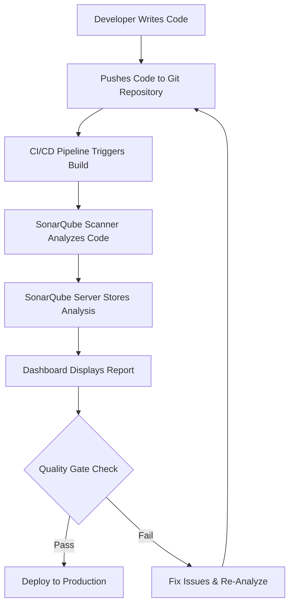

# 🚀 SonarQube: Code Quality & Security Analysis


## 📌 Introduction

SonarQube is a **Continuous Inspection** tool that performs **Static Code Analysis (SCA)** to detect **vulnerabilities, bugs, code smells, and duplications** in your codebase. It integrates seamlessly into **CI/CD pipelines**, ensuring high code quality before deployment.

---

## 🛠️ How SonarQube Works?

SonarQube follows a structured workflow to analyze and report on code quality:



---

## 🔍 Key Features

- **Static Code Analysis (SCA):** Detects issues before execution.
- **Security Scanning:** Identifies vulnerabilities (OWASP, CWE, SANS Top 25).
- **Code Smells Detection:** Highlights poor coding practices.
- **Technical Debt Management:** Estimates effort needed to fix issues.
- **Duplication Analysis:** Finds redundant code to improve maintainability.
- **Quality Gates:** Enforces code quality standards before merging.
- **Multi-Language Support:** Works with Java, Python, JavaScript, C++, and more.

---

## ⚙️ SonarQube in a DevOps Pipeline

| Step                        | Description                                              |
| --------------------------- | -------------------------------------------------------- |
| 📝 **Code Development**     | Developers write and commit code.                        |
| 🔄 **CI/CD Integration**    | Pipeline triggers SonarQube analysis.                    |
| 📊 **Static Code Analysis** | Scanner analyzes security, quality, and maintainability. |
| 📡 **Report Generation**    | Results are sent to the SonarQube Server.                |
| 🚦 **Quality Gate Check**   | If issues exceed thresholds, the build fails.            |
| ✅ **Deployment**            | If passed, the code is deployed to production.           |

---

## 🛡️ Security & Vulnerability Detection

SonarQube detects security vulnerabilities using:

- **OWASP Top 10** (Web Security Threats)
- **SANS Top 25** (Common Programming Errors)
- **CWE (Common Weakness Enumeration)**
- **Hardcoded Secrets Detection**
- **SQL Injection & XSS Protection**

---

## 🔑 Technical Terminologies for Devs

### 🔍 **Static Code Analysis (SCA)**

Analyzing source code without executing it to detect potential issues.

### 🎭 **SonarQube Scanner**

A command-line tool that scans the codebase and submits reports to the SonarQube Server.

### 🏗️ **Quality Gate**

A set of conditions that code must pass before being merged or deployed.

### 🛡️ **Security Hotspots**

Code areas that require **manual review** to ensure security compliance.

### 🔀 **Code Duplication**

Detects repeated blocks of code to improve efficiency and maintainability.

### 📊 **Technical Debt**

The estimated time required to fix maintainability issues.

### ⚡ **SonarLint**

An IDE plugin that provides **real-time** feedback while coding.

---

## 🚀 Getting Started with SonarQube

### 🔹 Install SonarQube Locally

```bash
docker run -d --name sonarqube -p 9000:9000 sonarqube:lts
```

Access the dashboard at [**http://localhost:9000**](http://localhost:9000).

### 🔹 Scan a Project

```bash
sonar-scanner \
  -Dsonar.projectKey=my_project \
  -Dsonar.sources=./src \
  -Dsonar.host.url=http://localhost:9000 \
  -Dsonar.login=your_token
```

### 🔹 Integrate with CI/CD (Jenkins Example)

```groovy
pipeline {
    stages {
        stage('SonarQube Analysis') {
            steps {
                script {
                    withSonarQubeEnv('SonarQube') {
                        sh 'mvn sonar:sonar'
                    }
                }
            }
        }
    }
}
```

---

## 📌 Conclusion

SonarQube is a powerful tool for maintaining **secure, high-quality, and maintainable code**. It integrates seamlessly into DevOps workflows, helping developers ship better code faster! 🚀

For more details, visit [SonarQube Docs](https://docs.sonarqube.org/).

